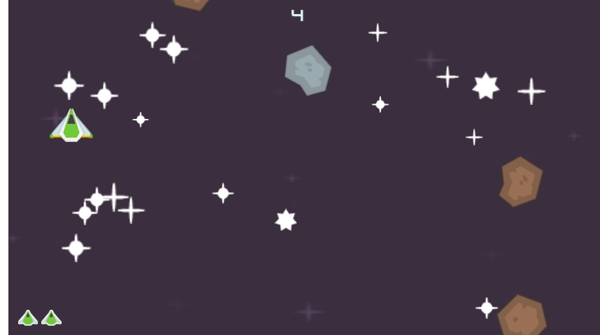
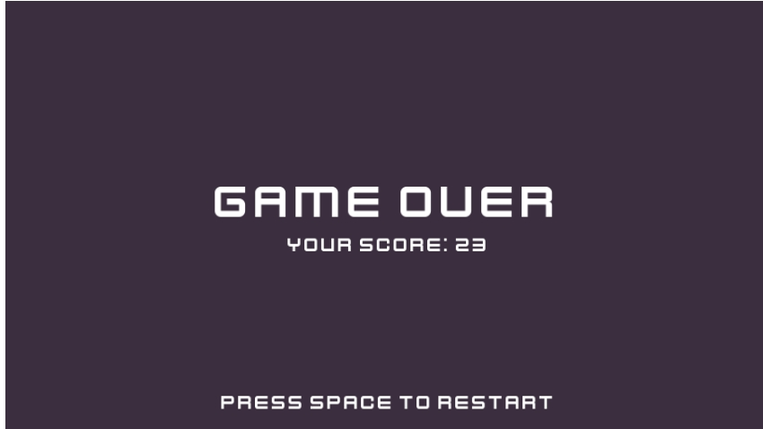

# Space Shooter Game

### Intro

This is a simple and straightfoward game I made as a beginner project in Godot. 

The aim of the game is to avoid the meteors for as long as possible, while shooting them also.

I followed this youtube playlist link: https://www.youtube.com/watch?v=q7wlSvt0JIc&list=PL4cUxeGkcC9iHCXBpxbdsOByZ55Ez4bgF

### Playing The Game

I was able to release a web version of the game on itch.io .
Here is the link for the game:
[Space Shooter by colonia458
](https://colonia458.itch.io/space-shooter)

#### Controls

**Movement:** Left/Right & Up/Down Keys

**Shooting Lasers:** Mouse Left Click / Spacebar

**Restart Game:** Spacebar

### Screenshots

